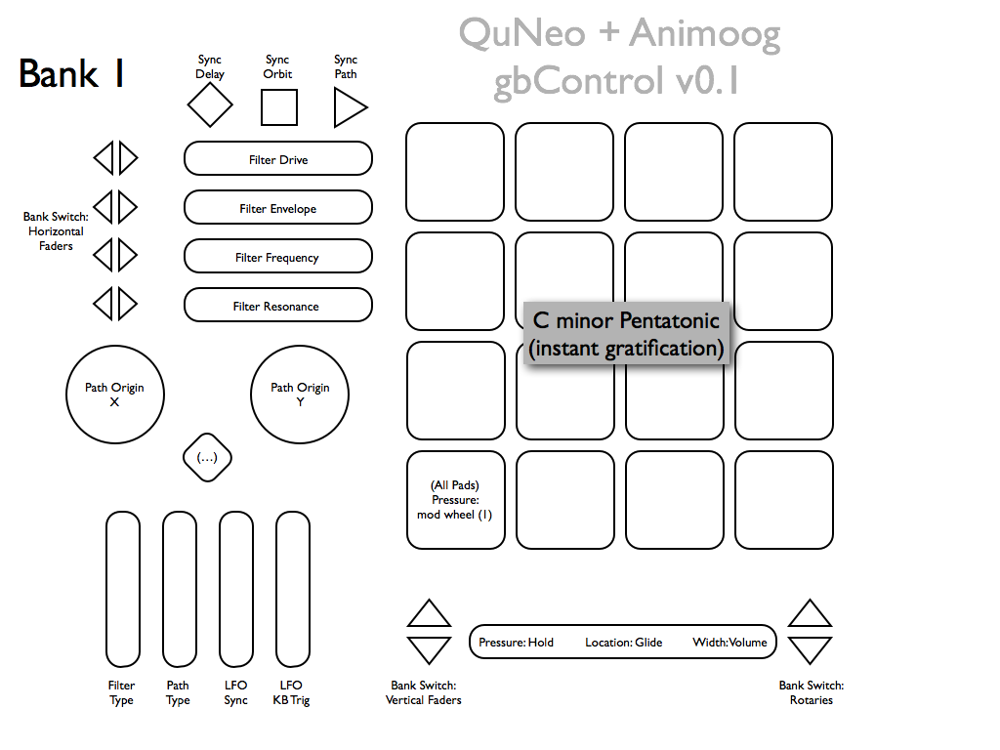
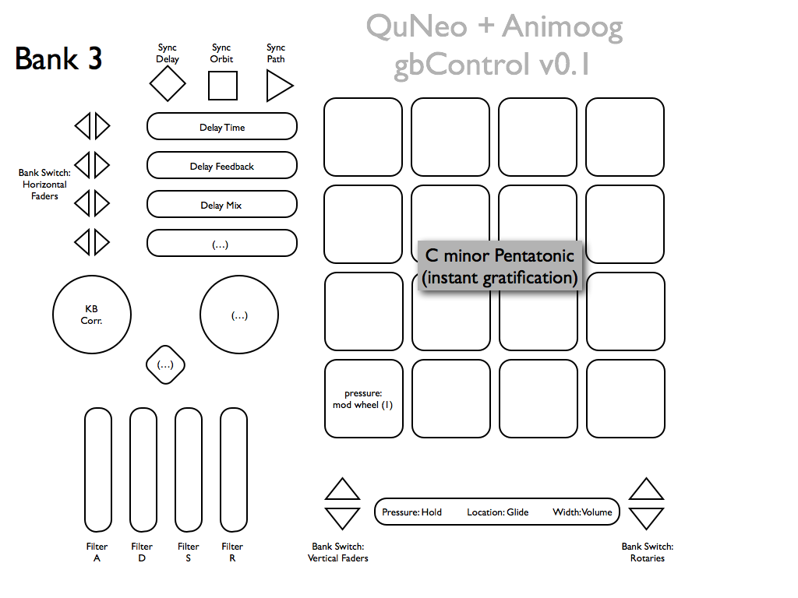
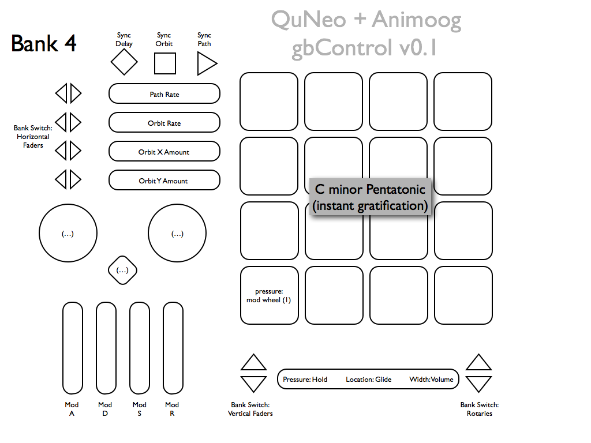

# README

**Animoog + QuNeo gbControl version 0.1** (hackity hack hack)

Please distribute. Please improve. Credit me if you fork and/or distribute. Above all, distribute and improve on this template. It took me longer to write up the bare-bones documentation than it did to sketch out and CC-map the idea to begin with.

To use the mod wheel control (pad pressure) you may need to remap that in each preset that uses poly-pressure instead, or have fun and assign it independently.

In the XY version, assign one axis, both, or none as you wish. This affects all pads, it's the same CCs applied to each pad's X/Y detection. Pressure is still mod wheel, so that means each pad can send Note, Velocity, Pressure, X, Y. Have fun with that and any X/Y CC clashes you may run into. Works great.

QuNeo Editor v1.2 was used, be sure to update your firmware safely.

**Next Steps** (Surely, OP will deliver… *crickets*):

- Map Animoog's MIDI OUT to provide real-time performance data on the QuNeo (if I ever get around to buying that IAP)
- Group the banks more intelligently, and fill in any control gaps
- Add more scales as pad banks, maybe group major/minor via pad corners. Not too handy for live playing for us butterfinger types, though.
- X-Y assignments used more intelligently. Pitch Bend is too unpredictable for me, YMMV.

Thanks – gb

---

